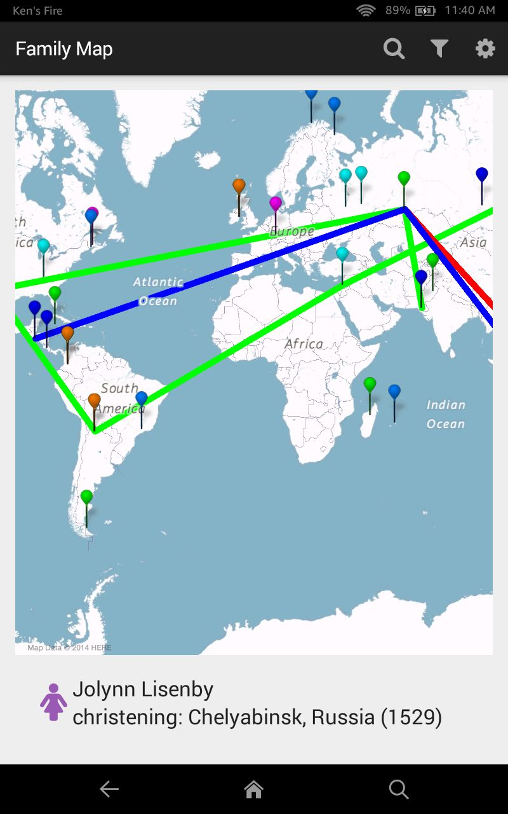

# FamilyMap Client

**Family Map** is an Android application that provides a geographical view into your family history. By inputting your family tree, you can explore where each member of your family was born, married, died, and other major life events on an interactive map.



This repository contains the Android client code, which communicates with a backend server to manage user information and family history data. The backend server is available in the [FamilyMapServer repository](https://github.com/yourusername/family-map-server).

## Features

- User login and registration
- Interactive maps showing family events
- Filtering and searching family history data
- Settings customization

## Getting Started

### Prerequisites

- [Android Studio](https://developer.android.com/studio)
- Android device or emulator with Google Play Services

### Installation

1. **Clone the Repository:**

   ```bash
   git clone https://github.com/yourusername/family-map-client.git
   cd family-map-client
   ```

2. **Open in Android Studio:**

   Open Android Studio and select `Open an existing Android Studio project`. Navigate to the `family-map-client` directory and open it.

3. **Build and Run the App:**

   Connect an Android device or start an emulator. In Android Studio, click on `Run -> Run 'app'` to install and run the app on your device/emulator.

### Usage

1. **Set Server Endpoint:**

   On the Login screen, enter the server hostname/IP address and port number where the FamilyMap Server is running.

2. **Login or Register:**

   - **Login:** Enter your username and password, then click "SIGN IN".
   - **Register:** Fill in all the fields and click "REGISTER".

3. **Explore the Map:**

   - View family events on the map.
   - Click markers to see event details.
   - Use the options menu to filter events, change settings, or search for specific events and people.

### Key Activities

- **Main Activity:** Login and top-level map view.
- **Person Activity:** View details about a person and their relationships.
- **Map Activity:** Centered map view on a specific event.
- **Settings Activity:** Customize settings, re-sync data, log out.
- **Filter Activity:** Apply filters to the displayed events.
- **Search Activity:** Search for people and events.

### License

This project is licensed under the MIT License - see the LICENSE.md file for details.

## Additional Resources

- [Android Development Documentation](https://developer.android.com/docs)
- [Google Maps for Android](https://developers.google.com/maps/documentation/android-sdk/start)

For more information, visit the [FamilyMapServer repository](https://github.com/yourusername/family-map-server).
